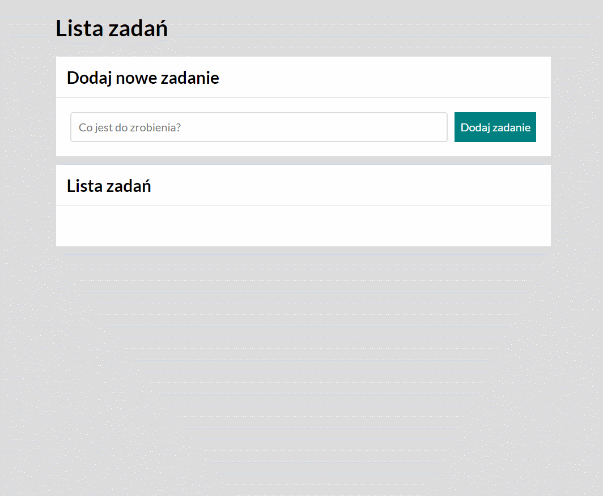

# Daniel Samsonowski - TO-DO-LIST ;)

## Demo

https://danonstinson.github.io/to-do-list-js/

## Description

TO-DO-LIST is an js practice exercise focused to combine objects, arrays, media queries in js.

## Technologies:
- JAVASCRIPT
- HTML
- CSS
- BEM
- Markdown
- Media queries
- Objects
- Arrays